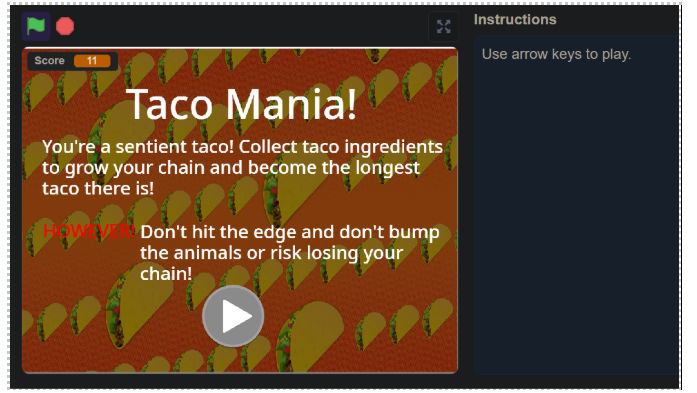
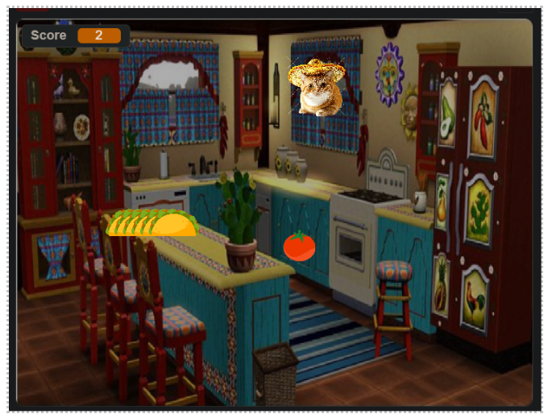

# L03_Team_TeamRocket_SaigeD_-ITAI_1370_2025Fall
Scratch-based Taco Challenge Video Game 

A collaborative project created for 2025 Sept-Dec AI-Hist 6261-16830-ITAI-1370 

 This is a simple online Taco Challenge game built in **Scratch**, developed as part of a group effort to practice coding, debugging, and documentation. 

--
 

**📋 Table of Contents**  

1. [Group Members and Roles](#group-members-and-roles)  
2. [Project Log](#project-log)  
3. [Features](#features)  
4. [Installation and Usage](#installation-and-usage)  
5. [Screenshots](#screenshots)  
6. [Issues and Solutions](#issues-and-solutions)  
7. [Future Improvements](#future-improvements)  
8. [License](#license)  
9. [Acknowledgments](#acknowledgments)  

 

**👥 Group Members & Roles** 

* Toyin Fadiran – Lead Documenter (notes, screenshots, README/reporting) 
* **Saide D** – Lead Character and BG Design(implemented movement & collision logic) 
* **Ranveer – Lead Programmer (sprites, UI, and visuals)** 
* Clinton – Lead Game Tester (bug fixes, QA) 
* Taylor – Lead Sound Design 
* Usen: Game Tester w/ Clinton 
* Anish: Documenter w/ Toyin 
* Khuliso: Sound Design w/ Taylor 

 

**📆 Project Log** 

(*See full detailed notes in [ProjectLog.md](./ProjectLog.md)*)

* **Day 1 (Wed, Oct 1:** Brainstormed video game ideas, set up initial Scratch website 
* Set up daily 8 pm CST Zoom calls (30-45 min) to collaborate with Group Members 
* Decided on Snake-like game with iteration for modern spin 
* [Project Log Set up to Document Progress](https://houcomcol-my.sharepoint.com/:w:/g/personal/w218102648_student_hccs_edu/ERtmzf7OcmlJqbKVIW-OsukBtimkNFN7sCSyrPX2AVARyw?e=kQetBu) 
* **Day 2:** Implemented snake movement & controls. 
* **Day 3:** Added scoring and collision detection. 
* **Day 4:** Debugged snake reversing issue, improved visuals. 
* **Day 5:** Final polish, documentation, and screenshots. 

 

**✨ Features** 

* Snake grows when eating food. 
* Collision detection with walls and self. 
* Score counter. 
* Game restart after loss. 

 

**💻 Installation & Usage** 

1. Clone the repository: <code>git clone [https://github.com/Toyin-Fadiran/L03_Team_TeamRocket_SaigeD_-ITAI_1370_2025Fall.git](https://github.com/Toyin-Fadiran/L03_Team_TeamRocket_SaigeD_-ITAI_1370_2025Fall.git)</code>  \
  
1. Open the `.sb3` file in[ Scratch](https://scratch.mit.edu/). 
1. Press the green flag ▶️ to start playing. 

 

**🖼️ Screenshots** 

***Starting Screen:*** 

 

***Gameplay:***
(avoid the animal obstacle 🐈! Capture the tomato 🍅) 

 

 

 

 

**🐛 Issues & Solutions** 

* **Issue:** Bug found where obstacle spawns right where taco chain link begins.  
* **Fix:** Added logic preventing near instantaneous object spawn.	 

 

**🚀 Future Improvements** 

* Add levels with increasing difficulty. 

